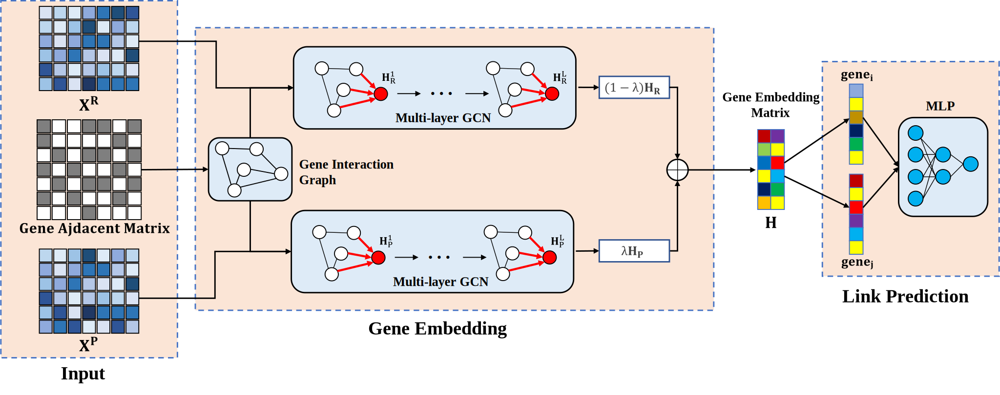

# MultiGNN: a novel model for inferring gene regulatory networks from transcriptomics data and chromatin accessibility

MultiGNN is a multi-omics GRN inference model that infers regulatory relationships between genes from gene expression data and chromatin accessibility data. The inputs to MultiGNN are the matched scRNA-seq and scATAC-seq count matrices and a priori gene networks. The output is the gene regulatory relationships predicted by MultiGNN.



## Dependencies

- python = 3.8.19
- tensorflow = 2.11.0
- scikit-learn = 1.3.2
- numpy = 1.23.5
- pandas = 2.0.3
- scipy = 1.10.1
- R = 4.3.2
- MAESTRO = 1.5.1

## Running

1. Run the required files. The[10k Human PBMCs](https://www.10xgenomics.com/cn/datasets/10-k-human-pbm-cs-multiome-v-1-0-chromium-x-1-standard-2-0-0) dataset will be used as a demo in the project: 

   - `./Data/10k_PBMC_Multiome_nextgem_Chromium_X_filtered_feature_bc_matrix.h5`: H5 file containing scRNA-seq and scATAC-seq count matrices.
   - `network_pbmc.csv`: Gene Regulatory Networks matching H5 Files.
   - `TF_list.txt`: List of transcription factors to be studied.

2. Data preprocessing was performed while the chromatin accessibility matrix was calculated as a gene potential matrix：

   ```
   Rscript Preproceing_multiomics.R
   ```

3. Command to run MultiGNN：

   ```
   python main.py
   ```

   If MultiGNN goes smoothly, it will return the prediction result in `./output/result.csv`.


